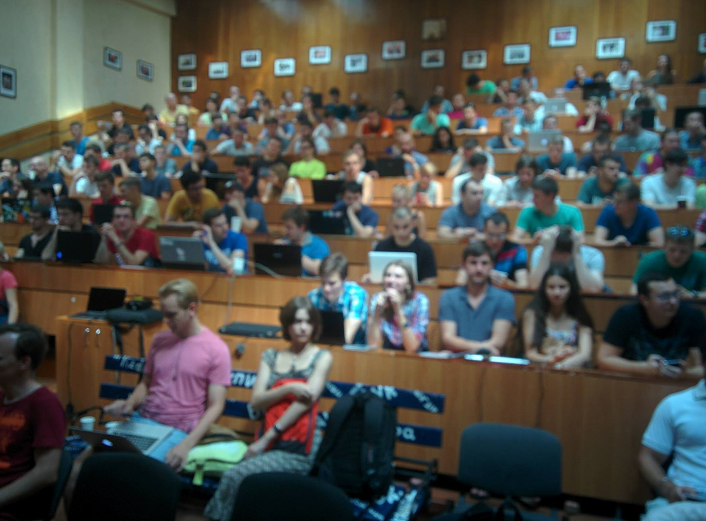
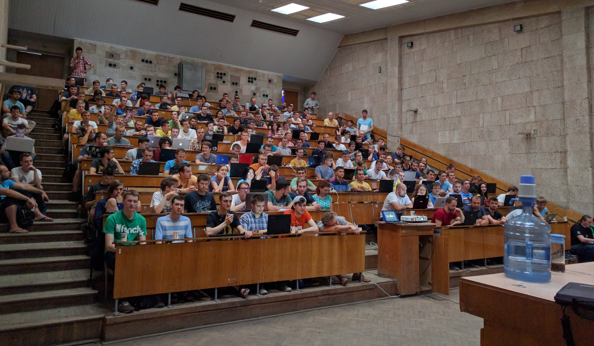
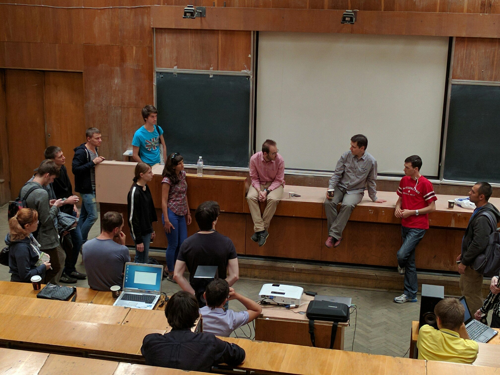
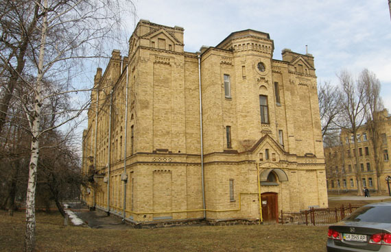
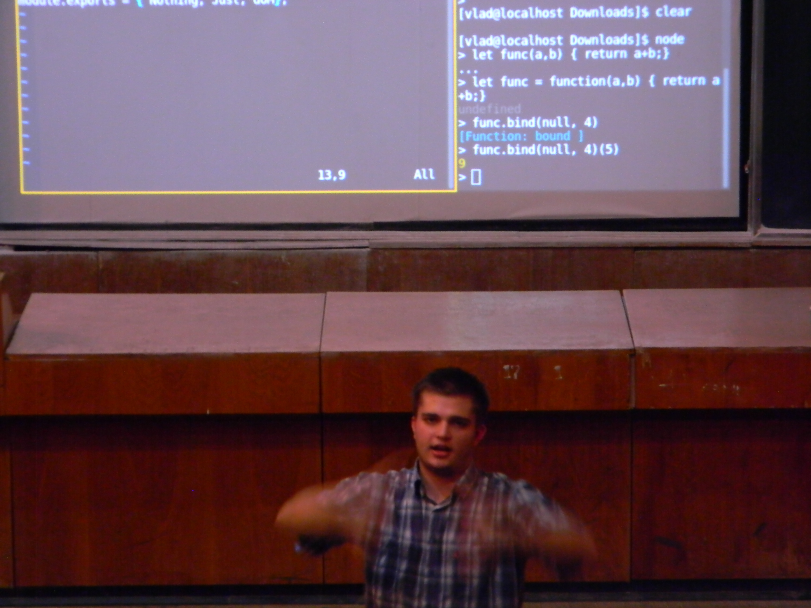
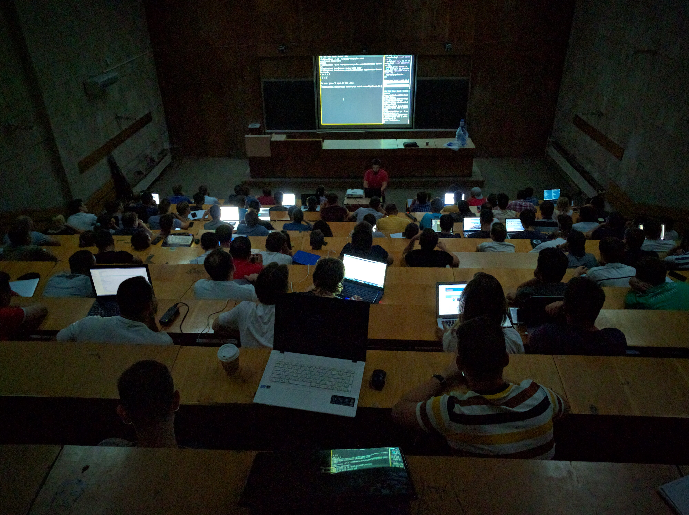
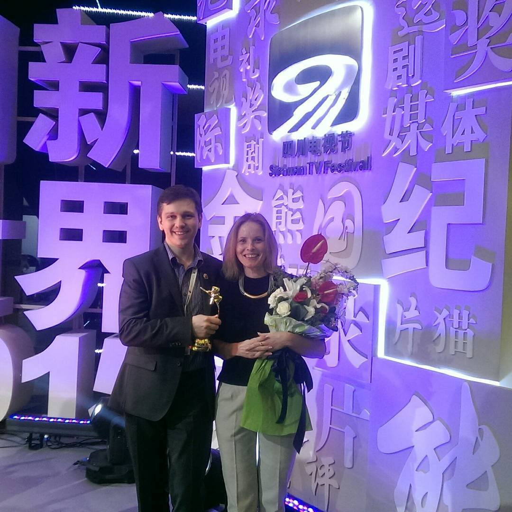
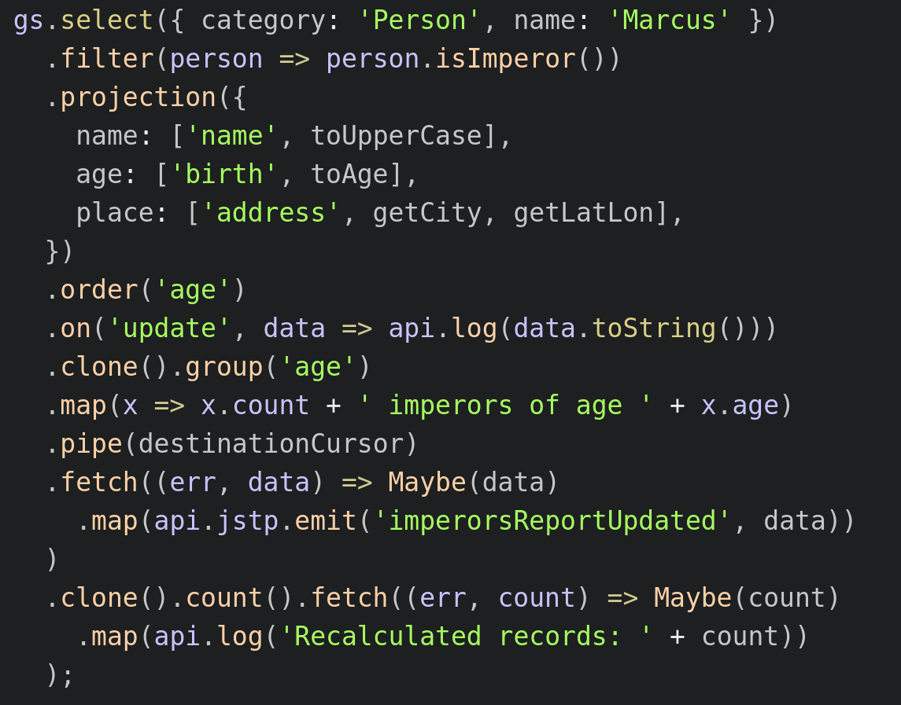

## «Ваше положение таково, что понять вам его невозможно»

---

### Тимур Шемсединов
<br>
КПИ ФИВТ

---



---

### Что я нашел в КПИ на 1 курсе
- коллектив профессионалов
- большие реальные проекты
- примеры кода и процесса
- мне ставили сложные задачи
- и научили их не бояться
- 20 лет проработал в НИИ СТ

---


<br>
github.com/HowProgrammingWorks

---

### Я возвращался в КПИ много раз
- прочитать серию лекций
- работать над проектами в НИИ
- искать кадры для своих проектов
- писать кандидатскую диссертацию

---


---

### К чему я пришел
- кадры решают все и учить их нужно самому
- студенты 2-3 курса могут невообразимое
- в ВУЗе много сложностей, но преодолимых
- коллектив должен воспроизводить себя
- нужно передавать опыт
- есть возможность ВУЗам существовать

---



---



---


---

### Переселился в КПИ



---

### Что сделано за 2 года
- изменения в курсе программной инженерии
- внедрены JavaScript и Node.js
- студенческое конструкторское бюро
- дополнительные семинары и лекции
- летние и зимнии школы
- митапы KievNodeJS теперь проводится в КПИ
  - 100-200 участников
  - более 1100 подписчиков

---


---


---



---



---

### Стек технологий Metarhia
- цельно спроектированный стек
- унифицированный и free
- коллектив разработчиков-фанатиков
- сервер приложений Impress
- сетевой протокол JSTP >10 ЯП
- СУБД GlobalStorage
- модули: metasync, tickplate и др.

---


---


---

### Внедрено в отраслях:
- интерактивное телевидение SinceTV
- системы высокочастотной торговли
- игры, коммуникационное ПО
- медицина, умная электроника
- управление прикладными облаками

---



---


---

### Open Souce / Free Software
- контрибьютеры Node.js
- не менее 5 преподавателей
- сотрудничество с Китаем
- ни какого страха - только NIH
- люди должны любить свою работу
- интересную, сложную, крутую
- галеры - на переработку

---

Вы поймете, как это работает

```js
const projection = (meta, obj) => (Object
  .keys(meta)
  .reduce((hash, key) => (hash[key] = meta[key]
    .reduce(
      (val, fn, i) => i === 0 ? obj[fn] : fn(val), null
    ), hash), {}
  )
);
```

---

И это... оно же просто красивое



---


---

### Контакты и ссылки

https://github.com/HowProgrammingWorks
https://github.com/metarhia
https://www.meetup.com/KievNodeJS

Тимур Шемсединов
<br>
timur.shemsedinov@gmail.com

---

## «Да у нас дыра,<br>но сквозь эту дыру<br>сквозит будущее»
